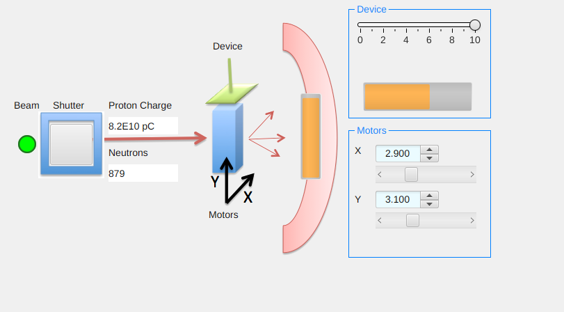
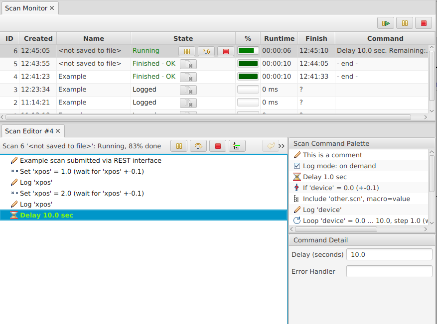
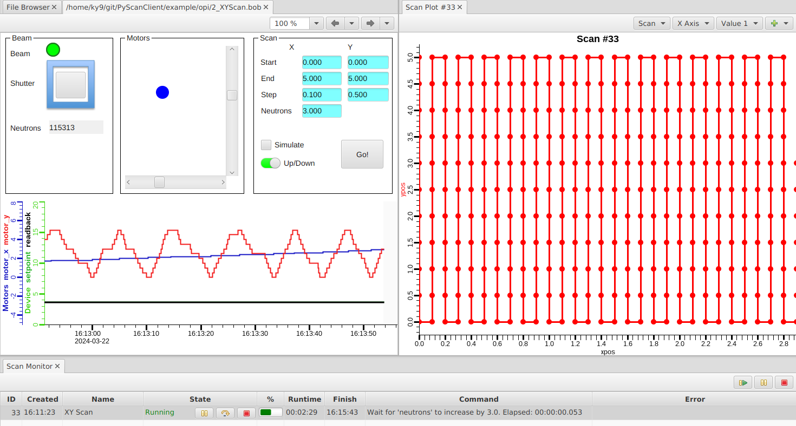

Getting Started
===============

In the following, we describe the setup and some basic scan server interactions.

Initial Setup
-------------

We assume that you already have a recent version of EPICS base installed
with access to commands like `softIoc`, `caget`, `caput`.

Prepare the PyScanClient::

   git clone https://github.com/PythonScanClient/PyScanClient.git
   cd PyScanClient
   python setup.py build
   export PYTHONPATH=`pwd`/build/lib

The scan server is a CS-Studio service.
Both the scan server and the CS-Studio GUI can be built
from https://github.com/ControlSystemStudio/phoebus.
More convenient binaries are available from
https://controlssoftware.sns.ornl.gov/css_phoebus/nightly/

Create a settings file for CS-Studio that holds the path to
this python library::

    echo org.csstudio.display.builder.runtime/python_path=$PYTHONPATH >>my_settings.ini

You may also add common settings like CA or PVA address lists
to that file, or add the `..runtime/python_path` setting to
an already existing local settings file.

All CS-Studio tools are based on Java. The CS-Studio GUI binary
may bundle a java runtime. If it includes a `jdk` folder, use that.
Otherwise fetch a Java runtime from https://jdk.java.net
Either way, declare your JDK and add its `bin` folder to the PATH::

  export JAVA_HOME=/path/to/jdk
  export PATH=$JAVA_HOME/bin:$PATH
  java -version

Assuming you fetched a scan server binary, start the scan server like this::

   unzip scan-server.zip
   rm scan-server.zip
   cd scan-server-*
   ./scan-server.sh

On success, note the REST URL and list of console commands::

   INFO ../ Scan Server (PID 1766187)
   INFO ... Scan Server REST interface on http://localhost:4810/index.html
   Scan Server Commands:
   help            -  Show commands
   ...
   shutdown        -  Stop the scan server

You would stop the scan server by typing `shutdown`, then restart via `scan-server.sh`.

Test Beamline
-------------

Subsequent sections use a simple test beamline.
Run it like this::

   cd PyScanClient/example
   softIoc -d ioc/simulation.db 

Assuming you fetched a binary for CS-Studio, start the associated GUI like this::

   unzip phoebus-linux.zip
   rm phoebus-linux.zip
   cd phoebus-*/
   ./phoebus.sh -settings /path/to/my_settings.ini -resource /path/to/PyScanClient/example/opi/1_BeamLine.bob

Familiarize yourself with the simulation.

* The "Beam" is mostly on, but occasionally turns off.
* Click on the "Shutter" to open or close it.
  While beam is on and the shutter open, the "Neutrons" counter increments.
  The "Proton Charge" increments as well, but you may
  only see that when you show it in "Probe" or a "Data Browser".
* Move the "X" and "Y" motor position sliders.
  There's a motor position that maximizes the signal on the detector
  (vertical orange bar).
* Move the "Device" setpoint slider and notice how its
  value (horizontal orange bar) follows with a delay.

Direct REST Access
------------------

The scan server is fundamentally a web service.
You will typically NOT directly interact with the web service,
but point your web browser to http://localhost:4810 and try the following.

* You should see a "Scan Server REST Interface" web page.
  Seeing that page confirms that the scan server is running.
  In an operational setup you might try to point a web browser on
  some control system operator interface host to http://name_of_server:4810
  to check network connectivity to the scan server.
* Follow the "/server/info" link.
  The XML format of the information is obviously not perfect for
  interactive use. For example, you would have to convert a UNIX epoch
  start time of "1711118742626" into "2024-03-22 10:45:42 EDT" to verify
  the scan server start time,
  but if all else fails such direct REST access can help you debug
  your setup on a low level.
* Back from the start page http://localhost:4810, click the
  "/scan/{name-of-new-scan}" link for submitting a new scan.
  The "Example" scan that is pre-populated in the web interface
  will set the "xpos" motor to 1, then 2, and log each value.
* "Submit" the scan and note in the CS-Studio GUI how the X motor is moved.
  The web interface will indicate the "ID" of the submitted scan and then
  switch to a list of scans. You may find the submitted scan either already finished
  or with an active "Delay 10.0 sec" command.
  Note that the web page needs a manual refresh to update.
  After a few manual refreshes, the scan should be "Finished".
* On the list of scans, follow the "(cmds)" link to view the commands of the scan,
  which should match what was submitted. Follow the "(data)" link and note how
  it lists one sample with value 1.0 and another with value 2.0.

Scan Server Console
-------------------

* In the scan server console, note how it logs each executed command.
  Type "help", then "scans". Type "commands ID" with the ID of the last submitted scan
  to get a list of commands. Type "data ID" to show the logged data.
* Stop the scan server by typing "shutdown" in its console, then restart the scan server.
  Try "scans" again.
  Note that "commands ID" will report an error because the list of commands
  is only held in memory for the duration of a scan server run.
  On the other hand, "data ID" will still show the logged data, which is persisted over
  scan server restarts.
  Those logged values are meant to help debug a scan or track its progress.
  It is neither meant to replace an archive system or experiment data aquision.
* Back from the start page http://localhost:4810, click the
  "/scan/{name-of-new-scan}" link and submit anoter example scan.

CS-Studio GUI
-------------

* In CS-Studio, invoke the menu Applications, Scan, Scan Monitor.
  You should see the last submitted scan as "Finished-OK",
  the others as simply "Logged".
* Right-click on any scan and open the "Data Table".
* Right-click no the "Finished" scan and open the "Scan Editor".
* In the scan editor, right-click to "Submit scan".
  It submits the same commands once more. While the scan is executing,
  the scan editor highlights the active command in green.
  Both the scan monitor and editor offer a red button to abort the scan.

* In the scan editor, create a list of "Delay 1 sec" commands by deleting everything else,
  dragging noe "Delay" command from th palette into the editor,
  then use copy/paste from the context menu or Control-drag-drop to
  create about 10 delays.
* Submit the scan and note how it highlights the active delay command.
  Use the "pause" button in either the scan monitor or editor to pause and then resume
  the commands.
* Quickly submit the scan multiple times from the scan editor.
  Use the "Re-submit Scan" entry from the scan monitor context menu.
  Note how one scan executes, and additional scans are queued up to
  be executed next. Idle scans can be moved up or down in the list of queued
  scans, or aborted.
* In the scan monitor, selet a few older scans, right-click on them and "Remove selected". 

The scan monitor is very useful to monitor
the progress of queued and active scans.

The scan editor could be used to manually assemble small scans,
but it's mainly meant to debug scans that have been submitted by other means.

The scan server will hold the commands of past scans in memory
and persist the logged data on disk, but this
is all meant to debug scans, not to replace data aquisition.
Based on memory usage thresholds, the scan server will automatically change
in-memory scans to only logged scans.
While the scan monitor can list many scans, reading the list of scans from
the server and displaying it will use noticable CPU once there are 10000 and more
scans in the list.
Periodically, for example when a new series of experiments start,
it is thus suggested to manually remove information for older scans,
either by deleting selected scans or by invoking "Remove completed scans"
from the scan monitor context menu.

Basic PyScanClient
------------------

Check the content of `example/commands1.py`
and run it::

  cd example
  python commands1.py

.. literalinclude:: ../example/commands1.py

Note how the python script assembles a list of commands.
It builds the recipe for one "scan", submits it to the scan server,
and exits.
The scan server then spends more than a minute to execute the submitted
commands.

In the CS-Studio scan monitor, right-click on the running scan to open
the "Scan Data Table" and watch how samples are added.
This internal data logger is again not meant to replace data aquisition,
but meant to assist in tracknig the progress of scans and to debug them.

At this point you may familiarize yourself with all the :ref:`scan_commands`,
especially the many options of the :class:`.Set` command.
The PyScanClient `tutorial` folder contains several examples
to try.

CS-Studio GUI combined with PyScanClient
----------------------------------------

In CS-Studio, use the menu File, Open to open `PyScanClient/example/opi/2_XYScan.bob`.
In addition to the beam, shutter and X/Y motors that we've already seen,
it adds a "Scan" section. By default, it will scan both motors from 0 to 5,
and at each position await 3 neutrons.

Press "Go!" and note how the Scan Monitor now shows a running "XY Scan".
Right-click on the scan in the monitor, open the "Scan Data Table"
and watch it add new data for each scanned position.
Close the data table and instead open the "Scan Data Plot".
From the "X Axis" drop-down, select "xpos", and from the "Value 1" drop-down select "ypos".

Start the next scan after "Up/Down" is turned off and compare the motor positions in the plot.

Check "Simulate" to submit the scan for simulation, without actually executing it.
Simulation can be useful to verify which commands will be created.
It performs a simple run time estimate based on rate-of-change estimates that
need to be configured on the scan server.

Default Device Settings
-----------------------

A command to turn a power supply on or set a voltage may be instantaneous::

    commands = [ Set('PS42:Voltage', 12.0), Comment("PS is now on at 12 Volts")]

But this device behavior tends to be the exception.
When controlling a motor, the EPICS motor support allows using a "put-callback"
to the device which waits until the motor reaches the desired location.
This mechanism is also referred to as "completion".
A temperature controller might support completion on its temperature
setpoint PV.
On devices that do not support completion, it may be possible
to read the current device state from a separate readback PV and wait until
it agrees with the commanded value.

Based on the device at hand, we want to use the appropriate :class:`.Set` command::

   Set('SomePV', 42.3, completion=True, timeout=30)
   Set('SomePV', 42.3, completion=True, timeout=3000)
   Set('SomePV', 42.3, completion=True, timeout=3000, readback="SomePV.RBV", tolerance=0.1)
   Set('SomePV', 42.3, readback="OtherPV", tolerance=10, timeout=15)
   
Unfortunately, the "correct" way to set a PV is not discernible from the outside.
It requires knowledge about the implementation of a PV in the IOC.
And even if the correct way to set a PV is known, having to type
all parameters for each `Set` command can be cumbersone.
The PyScanClient :ref:`scan_settings` provide a way to configure default parameters
for each PV.
Wrappers for the basic `Set`, `Loop` and `Wait` commands then use these defaults.
For an example, see `example/beamline_setup.py`:

.. literalinclude:: ../example/beamline_setup.py

The code in `example/beamline1.py`, `example/beamline2.py` and
`example/beamline3.py` shows how to take advantage of the
scan settings.

Table Scan
----------

TODO

Alignment Scan
-------------- 

TODO
Custom script commands

Production Setup
----------------

In the above example we executed the scan server within a terminal window.
A production setup would typically run it as a Linux service using `procServ`,
https://github.com/ralphlange/procServ

Both the scan server and the CS-Studio GUI are typically started by a site-specific
launcher script that adds `-settings /path/to/site/settings.ini`.

