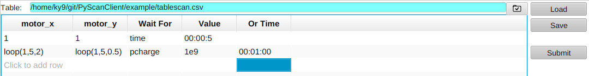
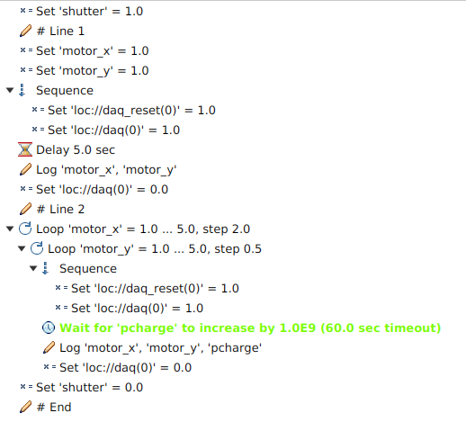
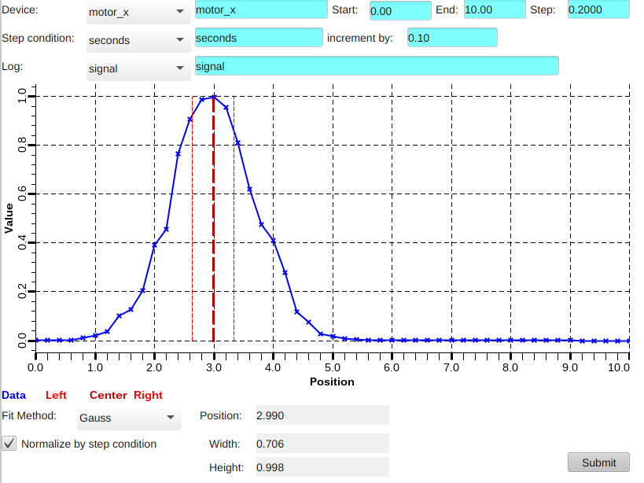
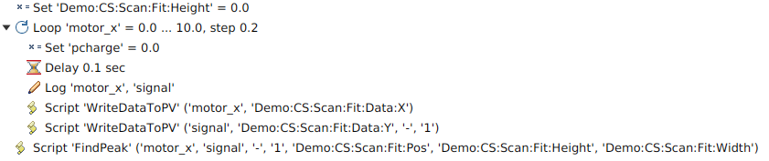

Getting Started
===============

In the following, we describe the setup and some basic scan server interactions.

Initial Setup
-------------

We assume that you already have a recent version of EPICS base installed
with access to commands like `softIoc`, `caget`, `caput`.

Prepare the PyScanClient library and examples::

   git clone https://github.com/PythonScanClient/PyScanClient.git
   cd PyScanClient
   python setup.py build
   export PYSCANCLIENT=`pwd`

In here, we don't "install" the library but simply access it via the python path.
In addition to the library, clients also need access to the examples,
so we add both to the path used by C-Python::
  
   export PYTHONPATH=$PYSCANCLIENT/build/lib:$PYSCANCLIENT/example

The scan server is a CS-Studio service.
Both the scan server and the CS-Studio GUI can be built
from https://github.com/ControlSystemStudio/phoebus.
More convenient binaries are available from
https://controlssoftware.sns.ornl.gov/css_phoebus/nightly/

All CS-Studio tools are implemented in Java. Some CS-Studio GUI binaries
bundle a java runtime. If it includes a `jdk` folder, use that.
Otherwise fetch a Java runtime from https://jdk.java.net.
Either way, declare your JDK and add its `bin` folder to the PATH::

  export JAVA_HOME=/path/to/jdk
  export PATH=$JAVA_HOME/bin:$PATH
  java -version

Both the scan server and the CS-Studio GUI likely need to access
the same PVs, so you can create a common `my_settings.ini` for them.
In here we start with just localhost::

   echo org.phoebus.pv.ca/addr_list=127.0.0.1 >>my_settings.ini

For more on PV related settings, see
https://control-system-studio.readthedocs.io/en/latest/preference_properties.html#pv

For the CS-Studio displays, we add the path to this python library and its examples::

    echo org.csstudio.display.builder.runtime/python_path=$PYTHONPATH >>my_settings.ini

This `.../python_path` setting is for CS-Studio displays to locate display scripts.
It is not required by the scan server, but for simplicity
you may combine settings in a common file loaded by all CS-Studio tools,
since the tools will ignore settings that don't apply to them.

The scan server uses an additional configuration file.
For a full example see https://github.com/ControlSystemStudio/phoebus/blob/master/services/scan-server/src/main/resources/examples/scan_config.xml

For these tests we use a simpler file based on this template
to primarily set the path used by server-side scripts:

.. literalinclude:: ../example/server/scan_config_template.xml

Based on that template, create the file for your PyScanClient example path::

   cat $PYSCANCLIENT/example/server/scan_config_template.xml |
   sed -e "s#<path>.*#<path>$PYSCANCLIENT/example/server</path>#" >my_scan_config.xml

Assuming you fetched a scan server binary, start the scan server like this::

   unzip scan-server.zip
   rm scan-server.zip
   cd scan-server-*
   ./scan-server.sh -settings /path/to/my_settings.ini -config /path/to/my_scan_config.xml
   
On success, note the REST URL and list of console commands::

   INFO ... Scan Server (PID 1766187)
   INFO ... Scan Server REST interface on http://localhost:4810/index.html
   Scan Server Commands:
   help            -  Show commands
   ...
   shutdown        -  Stop the scan server

You would stop the scan server by typing `shutdown`, then restart as just shown.

Test Beamline
-------------

Subsequent sections use a test beamline created by `simulation.db`.
The scan GUIs use additional databases.
Start them all in one IOC like this::

   cd $PYSCANCLIENT/example/ioc
   softIoc -m S=Demo -d simulation.db -d table.db -d range.db -d fit.db

Assuming you fetched a binary for CS-Studio, start the associated GUI like this::

   unzip phoebus-linux.zip
   rm phoebus-linux.zip
   cd phoebus-*/
   ./phoebus.sh -settings /path/to/my_settings.ini -resource $PYSCANCLIENT/example/opi/1_BeamLine.bob

.. image:: simulation.png

Familiarize yourself with the simulation.

* The "Beam" is mostly on, but turns itself off for brief periods.
* Click on the "Shutter" to open or close it.
  While beam is on and the shutter open, the "Neutrons" counter increments.
  The "Proton Charge" increments as well, but you may
  only see that when you show it in "Probe" or a "Data Browser".
* Move the "X" and "Y" motor position sliders.
  There's a motor position that maximizes the signal on the detector
  (vertical orange bar).
* Move the "Device" setpoint slider and notice how its
  value (horizontal orange bar) follows with a delay.

Direct REST Access
------------------

The scan server is fundamentally a web service.
You will typically NOT directly interact with the web service,
but point your web browser to http://localhost:4810 and try the following.

* You should see a "Scan Server REST Interface" web page.
  Seeing that page confirms that the scan server is running.
  In an operational setup you might try to point a web browser on
  some control system operator interface host to http://name_of_server:4810
  to check network connectivity to the scan server.
* Follow the "/server/info" link.
  The XML format of the information is obviously not meant for
  interactive use. For example, you would have to convert a UNIX epoch
  start time of "1711118742626" into "2024-03-22 10:45:42 EDT" to verify
  the scan server start time,
  but if all else fails such direct REST access can help you to debug
  your setup on a low level.
* Back from the start page http://localhost:4810, click the
  "/scan/{name-of-new-scan}" link for submitting a new scan.
  The "Example" scan that is pre-populated in the web interface
  will set the "xpos" motor to 1, then 2, and log each value.
* "Submit" the scan and note in the CS-Studio GUI how the X motor is moved.
  The web interface will indicate the "ID" of the submitted scan and then
  switch to a list of scans. You may find the submitted scan either already finished
  or with an active "Delay 10.0 sec" command.
  Note that the web page needs a manual refresh to update.
  After a few manual refreshes, the scan should be "Finished".
* On the list of scans, follow the "(cmds)" link to view the commands of the scan,
  which should match what was submitted. Follow the "(data)" link and note how
  it lists one sample with value 1.0 and another with value 2.0.

Scan Server Console
-------------------

* In the scan server console, note how it logs each executed command.
  Type "help", then "scans". Type "commands ID" with the ID of the last submitted scan
  to get a list of commands. Type "data ID" to show the logged data.
* Stop the scan server by typing "shutdown" in its console, then restart the scan server.
  Try "scans" again.
  Note that "commands ID" will report an error because the list of commands
  is only held in memory for the duration of a scan server run.
  On the other hand, "data ID" will still show the logged data, which is persisted over
  scan server restarts.
  Those logged values are meant to help debug a scan or track its progress.
  It is neither meant to replace an archive system or experiment data aquision.
* Back from the start page http://localhost:4810, click the
  "/scan/{name-of-new-scan}" link and submit anoter example scan.

CS-Studio GUI Scan Tools
------------------------

* In CS-Studio, invoke the menu Applications, Scan, Scan Monitor.
  You should see the last submitted scan as "Finished-OK",
  the others as simply "Logged".
* Right-click on any scan and open the "Data Table".
* Right-click on the "Finished" scan and open the "Scan Editor".
* In the scan editor, right-click to "Submit scan".
  It submits the same commands once more. While the scan is executing,
  the scan editor highlights the active command in green.
  Both the scan monitor and editor offer a red button to abort the scan.

.. image:: scan_monitor_editor.png

* In the scan editor, create a list of "Delay 1 sec" commands by deleting everything else,
  dragging one "Delay" command from the palette into the editor,
  then use copy/paste from the context menu or Control-drag-drop to
  create about 10 delays.
* Submit the scan and note how it highlights the active delay command.
  Use the "pause" button in either the scan monitor or editor to pause and then resume
  the commands.
* Quickly submit the scan multiple times from the scan editor.
  Use the "Re-submit Scan" entry from the scan monitor context menu.
  Note how one scan executes, and additional scans queue up to
  be executed next. Idle scans can be moved up or down in the list of queued
  scans, or aborted.
* In the scan monitor, select a few older scans, right-click on them and "Remove selected". 

The scan monitor is very useful to track the progress of queued and active scans.

The scan editor could be used to manually assemble small scans,
but it's mainly meant to debug scans that have been submitted by other means.

The scan server will hold the commands of past scans in memory
and persist the logged data on disk, but this
is all meant to debug scans, not to replace data aquisition.
Based on memory usage thresholds, the scan server will automatically reduce
in-memory scans to logged scans.
While the scan monitor can list many scans, reading the list of scans from
the server and displaying it in the GUI will use noticable CPU once there are
10000 and more scans in the list.
Periodically, for example when a new series of experiments start,
it is thus suggested to manually remove older scans,
either by deleting selected scans or by invoking "Remove completed scans"
from the scan monitor context menu.

Basic PyScanClient
------------------

Check the content of `example/commands1.py`
and run it::

  cd example
  python commands1.py

.. literalinclude:: ../example/commands1.py

Note how the python script assembles a list of commands.
It builds the recipe, submits it to the scan server, and exits.
The scan server then spends more than a minute to execute the submitted
commands.

In the CS-Studio scan monitor, right-click on the running scan to open
the "Scan Data Table" and watch how samples are added.
This internal data logger is again not meant to replace data aquisition,
but assists in tracking the progress of scans.

At this point you may familiarize yourself with all the :doc:`scan commands <commands>`,
especially the many options of the :class:`.Set` command.
The PyScanClient `tutorial` folder contains several more example scripts.

Default Device Settings
-----------------------

The command to set a power supply voltage may be instantaneous::

    commands = [ Set('PS42:Voltage', 12.0),
                 Comment("PS is now on at 12 Volts") ]

But this device behavior tends to be the exception.
When controlling a motor, the EPICS motor support allows a "put-callback"
to the device which waits until the motor reaches the desired location.
This mechanism is also referred to as "completion".
A temperature controller might support completion on its temperature
setpoint PV.
On devices that do not support completion, it may be possible
to read the current device state from a separate readback PV and wait until
it agrees with the commanded value.

Based on the device at hand, we want to use the appropriate :class:`.Set` command::

   Set('SomePV', 42.3, completion=True, timeout=30)
   Set('SomePV', 42.3, completion=True, timeout=3000)
   Set('SomePV', 42.3, completion=True, timeout=3000, readback="SomePV.RBV", tolerance=0.1)
   Set('SomePV', 42.3, readback="OtherPV", tolerance=10, timeout=15)
   
Unfortunately, the "correct" way to set a PV is not discernible from the outside.
It requires knowledge about the implementation of a PV in the IOC.
And even if the correct way to set a PV is known, having to type
all parameters for each `Set` command can be cumbersone.
The PyScanClient :doc:`scan settings <scan_settings>` provide a way to configure default parameters
for each PV.
Wrappers for the basic `Set`, `Loop` and `Wait` commands then use these defaults.
For an example, see `example/beamline_setup.py`:

.. literalinclude:: ../example/beamline_setup.py

The code in `example/beamline1.py`, `example/beamline2.py` and
`example/beamline3.py` shows how to take advantage of the
scan settings.

CS-Studio GUI combined with PyScanClient
----------------------------------------

End users can assemble recipes for a scan by writing python
scripts similar to the ones shown so far.
In practice, however, it is more likely for experts to prepare such scripts.
End users then adjust key parameters and execute the script.

For frequently used recipes, a GUI can be added.
Instead of editing a script and executing it in a terminal window,
users can then set parameters and submit a scan from the GUI.

In CS-Studio, use the menu `File`, `Open` to open `PyScanClient/example/opi/2_XYScan.bob`.
In addition to the beam, shutter and X/Y motors that we've already seen,
it adds a "Scan" section. By default, it will scan both motors from 0 to 5,
awaiting 3 neutrons at each position.

Press "Go!" and note how the Scan Monitor now shows a running "XY Scan".
Right-click on the scan in the monitor, open the "Scan Data Table"
and watch it grow by a row for each scanned position.
Close the data table and instead open the "Scan Data Plot".
From the "X Axis" drop-down, select "motor_x", and from the "Value 1" drop-down select "motor_y".

.. image:: scan_xy.png

Start the next scan after "Up/Down" is turned off and compare the motor positions in the plot.

Check "Simulate" to submit the scan for simulation, without actually executing it.
Simulation can be useful to verify which commands will be created.
It performs a simple run time estimate based on rate-of-change estimates that
need to be configured on the scan server.

To see how this is implemented, open the display in the CS-Studio display editor.
In this example, all scan parameters use local PVs. If you prefer to persist
the parameters when the display is closed and later re-opened,
you would use real PVs. 
Pushing the "Go!" button executes `example/opi/scripts/xy_scan.py`:

.. literalinclude:: ../example/opi/scripts/xy_scan.py

This script executes within the GUI with access to the widgets in the display.
It is handled by Jython and can use the PyScanClient the same way as
C-Python running outside the GUI.

Table Scan
----------

Scans that need to set devices like motors to a list of desired positions,
start data acquisition at each point, wait for some condition, stop data acquisition,
and then move to the next point can often be expressed in a concise table notation.

In CS-Studio, use the menu `File`, `Open` to open `PyScanClient/example/opi/3_Table_Scan.bob`.
Push the file folder button next to the "Table:____" text field to
locate the file `PyScanClient/example/tablescan.csv`.
Press "Load" and "Submit".

In short, table columns are typically PV names, and cells contain their values.
Cell values for PVs may contain plain values as in the first row
which sets both motors to 1.
Cells may also contain lists of values or `loop(start, end, step)` constructs,
as in the second row which will create nested loops setting
`motor_x` to 1, 3, 5, while an inner loop will set
`motor_y` to 1, 1.5, 2, ..., 4.5, 5.0.

The triplet of columns "Wait For", "Value" and "Or Time" has special meaning.
In the first row, after setting the motor positions, we wait for 5 seconds.
In the second, we wait for the proton charge to increment by 1e9,
or move on after 1 minute, whichever comes first.
Either way, the `Start()` commands which presumably start data aquisition are executed just
before we wait, and the `Stop()` commands which close data aquisition are executed after each "Wait For".
Each PV that is used in a table row is logged at the end of each row.

Finally, the list of commands created for a table scan start with `Pre()` commands and end with `Post()`
commands. In the `beamline_setup.py` shown above those are used to open and then close the shutter.
The resulting list of commands can be checked by opening the submitted scan in the scan editor:

See :mod:`scan.table.table_scan` for more on the table syntax.

The PyScanClient fundamentally supports table scans in CSV format.
The CS-Studio GUI offers a basic table display where values
can be adjusted before submitting.
Most spreadsheet programs can be used to create or edit more
extensive table scans, which are then exported as CSV
to load and submit them from the GUI.
You may also extend your local copy of the tablescan GUI scripts
to call out to tools like the LibreOffice file converter,
"soffice --convert-to csv ...",
which then allows the GUI to directly load such spreadsheet files
without manual conversion to CSV.

Alignment Scan
-------------- 

One fairly common beamline procedure is an alignment.
For example, a slit or sample is moved across a range of positions,
the intensity of a signal is noted at each position,
and we try to locate the maximum of that signal.

In CS-Studio, use the menu `File`, `Open` to open
`PyScanClient/example/opi/1_BeamLine.bob`
and in there set the "Y" motor to 3.0.
Now open `PyScanClient/example/opi/4_Alignment_Scan.bob`.
Adjust the settings as shown in the following screenshot, then press "Submit".
The GUI submits commands for moving the X motor over a range of positions.
At each step we wait for some time, then log the motor position and some signal.
Finally, a gaussian fit is performed to locate the peak in that signal.

When inspecting the submitted commands by opening them from the scan monitor
into the scan editor, the commands for moving the motor and logging
the signal are quite straight forward.
In addition, there are "script" commands.

Script commands can invoke jython code within the scan server.
These scripts have access to PVs and to the logged data of a scan.
In this alignment scan, a "WriteDataToPV" script command
is invoked to write data from the logged "motor_x" and the logged "signal"
into waveform PVs. Those waveform PVs are then shown in the display
to track the progress of the scan.
Finally, a "FindPeak" command is used to locate the peak in the logged data
and to publish the result via PVs.

For more on the :class:`.Script` command, check its documentation in the
list of :doc:`scan commands <commands>`.
For implementation details of these specific custom scripts,
look for `writedatatopv.py` and `findpeak.py` in the `PyScanClient/example/server` folder.

Note that this example not only introduces script commands but also stretches
their purpose.
The jython code of a script command has access to most of the scan server.
It can implement functionality that is not offered by the basic scan commands.
This is both an opportunity and a risk. The use of script commands should
remain limited. Each script command needs to be well tested to assert that it
is not impacting the robustness of the scan server.

For this specific example of an alignment scan, a better solution is
the implementation of an alignment IOC.
This may be done in python, using a python channel access or PV access server library.
Such an alignment IOC has PVs similar to those shown in this alignment display
to configure which PVs to "move", how to wait at each step, and what signal
to log. Implementing such an alignment IOC in python opens up access
to many types of peak fitting algorithms.
The alignment IOC should have an option to end with positioning the moved
motor at the peak of the signal.
Finally, the alignment IOC should expose a "Run" PV which supports put-callback.

Such an alignment can then be invoked interactively from a GUI,
but it can also be configured and started from a scan,
for example a table scan which configures the alignment PVs
and then writes to the "Run" PV, using completion.

Production Setup Notes
----------------------

In the above example we executed the scan server within a terminal window.
A production setup would typically run it as a Linux service using `procServ`,
https://github.com/ralphlange/procServ

Both the scan server and the CS-Studio GUI are typically started by a site-specific
launcher script that adds `-settings /path/to/my_settings.ini`.

By default, the scan server log is stored in the `/tmp` folder.
In the `scan_config.xml`, it should be configured to be in a more permanent location.

The scan config file can also list "pre" and "post" commands that are always
executed at the start and end of each scan. Specifically, the "post" commands
are executed both when a scan completes successfully and when it fails.
